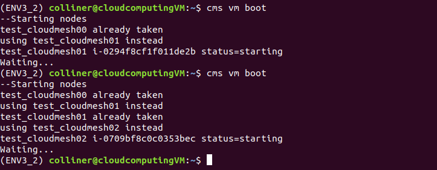
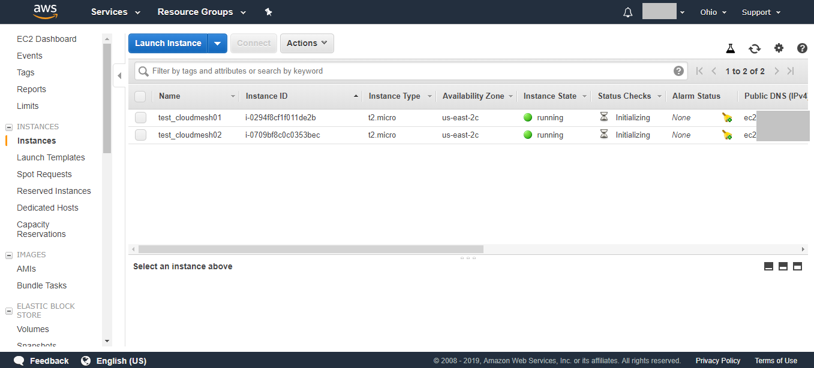
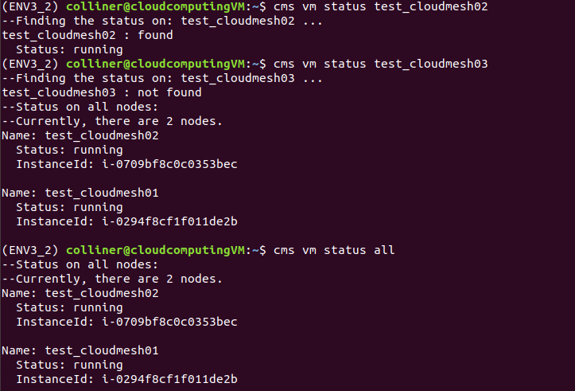
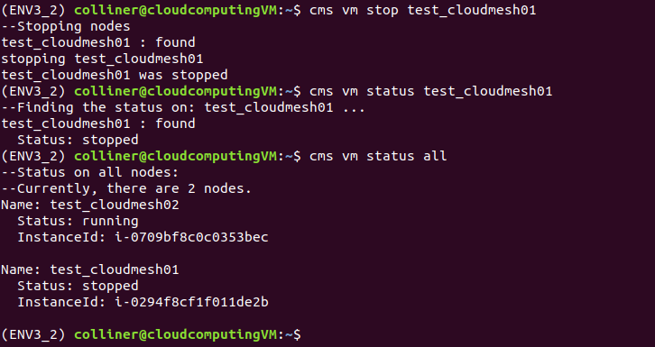
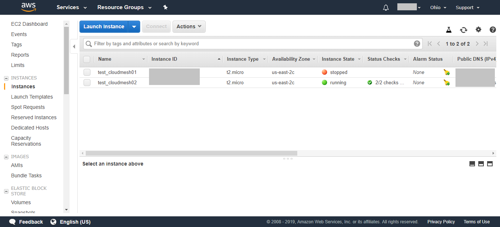

# VM Manager - AWS

Eric Collins

Last updated: 19 April 2019

## Introduction

An implementation of Virtual Machine manager with AWS is implemented as the vm.py code. Link to the code can be found in the README. To run the AWS vm manager, AWS credentials need to be present in ~/.cloudmesh/cloudmesh4.yaml as well as the related defaults for booting virtual machines in AWS. Below are the commands implemented into the AWS vm manager in cloudmesh, including displaying status, booting new AWS vms, booting multiple AWS vms, stopping vms, and creating unique names for each new vm booted. The following is a demo (pytest in progress) and explanation to how the code works. Oracle VM VirtualBox was used running an ubuntu system, python 3.7.2 environment was used with pyenv. More features to implement are explained at the end of this report.

## Features

### cms newawsvm status

The status command is implemented to find all nodes running on AWS (or eventually all other clouds specified). If the keyword "all" is present, status return the status on all currently running nodes. In the example below, there are no nodes running associated with the current AWS account. The user can specify vm name or names as shown in the next two examples of picture 1. If the name or names are not found, status on all nodes will be displayed. If no keyword for all or name is specified, cms vm status will default to displaying all information.

### cms newawsvm boot

The boot status is implemented to boot a vm in AWS, name defaulted to test_cloudmesh00. If name is taken, the increment_string() function will either:

1. add a number to the end
2. if a number is present at the end, new vm name will be incremented version of that name

As shown in the picture below, two new virtual machines are booted both called as test_cloudmesh01. The second time the request is made, the name is taken, so test_cloudmesh02 is used instead.

To prove consistency, the AWS Instance manager (shown below) now shows the two test_cloudmesh0* vms made with the default settings.

Now if the status command is run (shown below), one can specify the vm that is running to check its status, shown as test_cloudmesh02: status returned running. If the name specified is not found (test_cloudmesh03), status on all nodes are returned.

### cms newawsvm stop

The stop command is implemented to stop a specified vm name (see below). If no name is specified an error occurs to enter a name.

### increment_string()

Increment string works by finding the furthest set of numbers from the beginning of a name and incrementing it by one. As shown in the example below, the number of vms to start can be specified and since the name test00_cloudmesh00 was already taken, the incrementor will find the next number. Test00 is specified in the beginning of the string, the incrementer skips over this number and only increments the trailing number 01 - > 05.

## Concluding Remarks

SSH functionality/implementation has been started, the cms vm status would have to display information on how to ssh into each vm. the key.pm would also need to be located somewhere nearby or indicated in the cloudmesh4.yaml file. The way this vm manager is setup lends well to expanstion to multiple types of clouds, as the data structure for cloud/nodes is an array which my implementation loops over. This could be useful for finding names of nodes from multiple cloud providers and if booted with my code would check all nodes for a similar name before booting up the new node. MongoDB could also be used to store the status/update it when changed for any of the nodes, then this code could update the status from the clouds and read from MongoDB.

