# VM Manager - AWS (ec2 / libcloud)

Eric Collins ( colliner / sp19-516-127 )

Last updated: 21 April 2019

## Introduction

An implementation of Virtual Machine manager with AWS is implemented as the vm.py code using ec2 and libcloud. Earlier versions of the code were done with Boto2, however, as advised, all code was converted to libcloud. Link to the code can be found in the README. To run the AWS vm manager, AWS credentials need to be present in ~/.cloudmesh/cloudmesh4.yaml as well as the related defaults for booting virtual machines in AWS. Below are the commands implemented into the AWS vm manager in cloudmesh, including displaying status, booting new AWS vms, booting multiple AWS vms, stopping vms, restarting vms, terminating vms, and creating unique names for each new vm booted. The following is a demo (pytest in progress) and explanation to how the code works. Oracle VM VirtualBox was used running an ubuntu system, python 3.7.2 environment was used with pyenv. More features to implement are explained at the end of this report.

## Features

Features implemented by colliner include:

1. cms vm status    (displays status of aws nodes)
2. cms vm default   (displays default parameters for aws vm from .yaml file)
3. cms vm boot      (created a new node)
4. cms vm stop      (stops a currently running node)
5. cms vm start     (restarts a stopped node)
6. cms vm terminate (terminates a running or stopped node)

As well as a naming incrementer to avoid naming different nodes the same name along with --dryrun.

### cms newawsvm status

The status command is implemented to find all nodes running on AWS (or eventually all other clouds specified). If the keyword "all" is present, status return the status on all currently running nodes. In the example below, there are no nodes running associated with the current AWS account. The user can specify vm name (or names, see later in this document for multiple status display) as shown in the next few examples of picture 1. If the name or names are not found, status on all nodes will be displayed. If no keyword for all or name is specified, cms vm status will default to displaying all information.

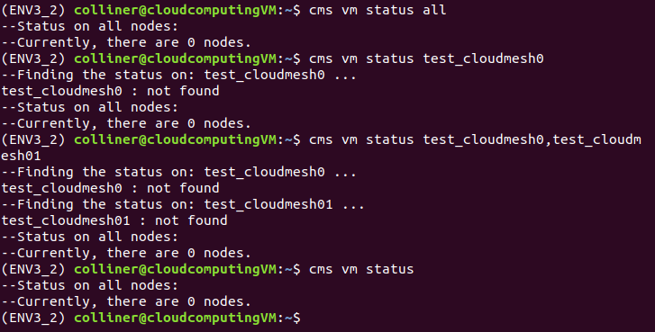

Alternatively, if there are nodes associated to the users AWS account, and "cms vm status" is invoked with no name, a simple list of vm names will appear (see below). If the user specifies a name and a virtual machine under that name exists, a table will print with the corresponding information.

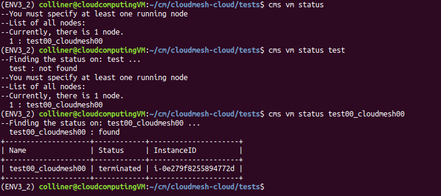

This can be verified through the online AWS instance manager (see below).

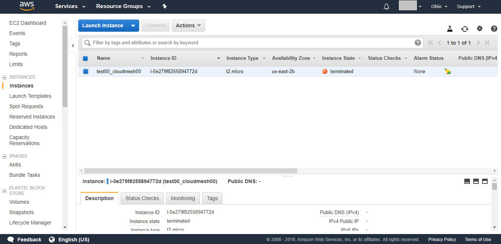

If many nodes are running, the user can specify multiple names in the command line to display only certain vms status.

Verified with the online AWS instance Manager.

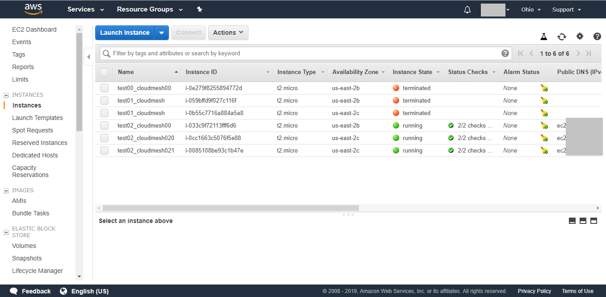

### cms newawsvm default

To display the default settings for creating nodes in AWS, use the command default. This will read the ~/.cloudmesh/cloudmesh4.yaml file and return the defaults in a table.

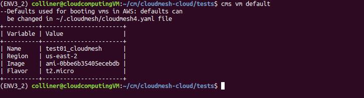

### cms newawsvm boot

The boot command is implemented to boot a vm in AWS. If name is taken, the increment_string() function will either:

1. add a number to the end
2. if a number is present at the end, new vm name will be incremented version of that name

As shown in the image below, to boot a vm, the user can specify no name (will default to test01_cloudmesh for this example, can be changed or indicated by the user). Note --dryrun returns all of the information about the node that would have been created. Here the user can also specify any name with --name=NAME, or --n=COUNT to start multiple vms.

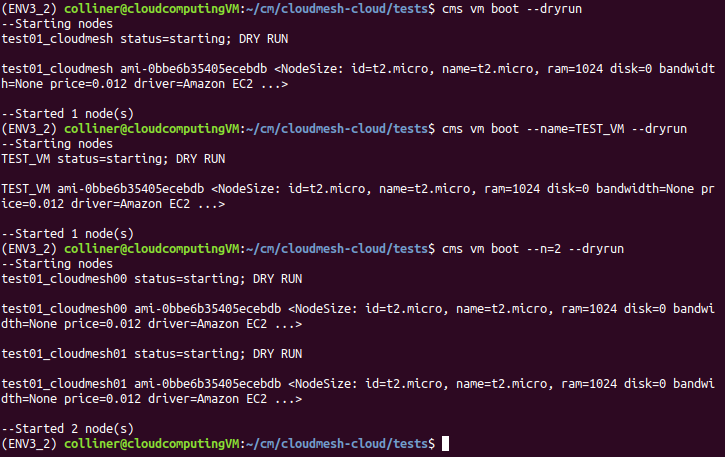

WARNING: if testing the next functionary use --dryrun.
The user can specify any number of vm to start n=1000 for example and the incrementer will rename them accordingly:

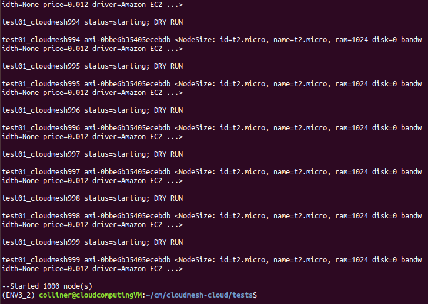

The user can also specify an image available, with image=IMAGE shown below.

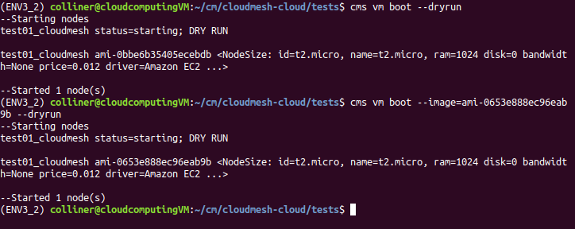

The incrementer is needed because as shown in image below, AWS has no restrictions on the name of the vm started ( as long as the InstanceID is unique).

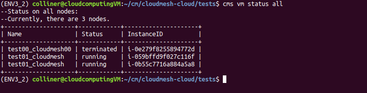

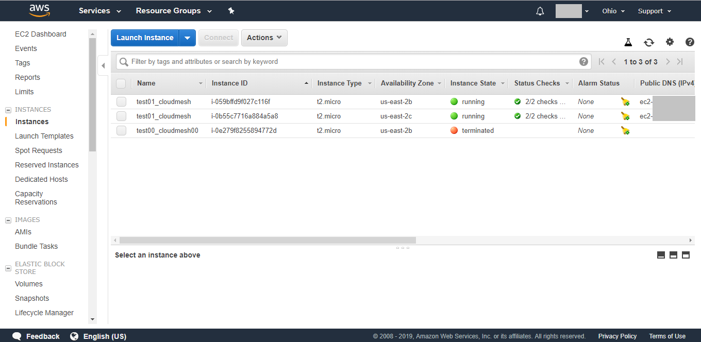

See below for a further explanation of the increment_string()

### cms newawsvm stop

The stop command is implemented to stop a specified vm name (see below). If no name is specified an error occurs to enter a name. If a name of a vm that does not exist is specified cms vm stop outputs NAME : not found; NAME was not stopped. In the example shown below, --dryrun can be used to see if the NAME would have been stopped. While in the absence of dryrun, the vm is stopped (test02_cloudmesh00 stopped and test02_cloudmesh020 not stopped dryrun)

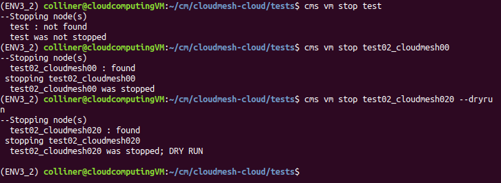

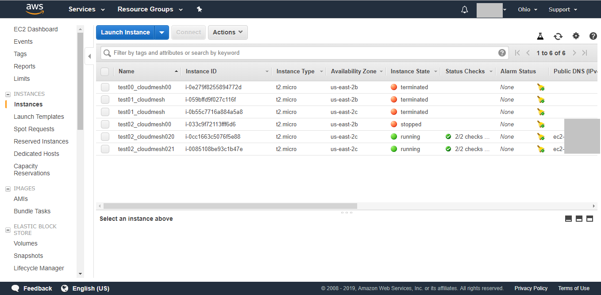

### cms newawsvm start

This command restarts a stopped node. If the node cannot be restarted or the state is pending, stopped, or terminated, the node status will not change as these nodes cannot be stopped.

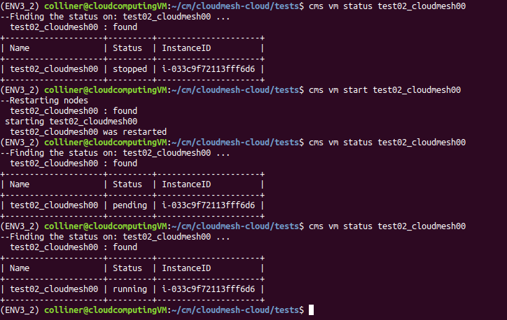

For example, if a terminated node is asked to be restarted, the error message will occur:

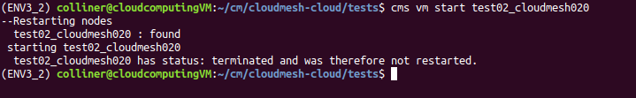

### cms newaws terminate

The terminate command will terminate an vm specified through NAME or NAMES.

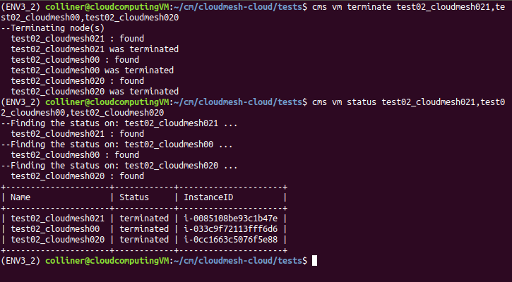

and can be verified through the online manager.

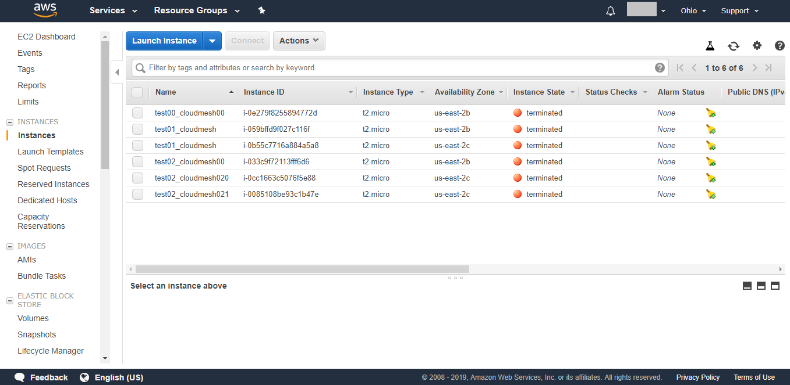

### increment_string()

Increment string works by finding the furthest set of numbers from the beginning of a name and incrementing it by one. As shown in the example below, the number of vms to start can be specified and since the name test00_cloudmesh00 was already taken, the incrementor will find the next number. Test00 is specified in the beginning of the string, the incrementer skips over this number and only increments the trailing number 01 - > 05.

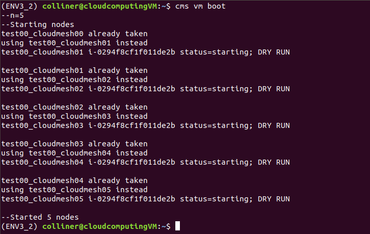

## Concluding Remarks

SSH functionality/implementation has been started, the cms vm status would have to display information on how to ssh into each vm however the key.pm would also need to be located somewhere nearby or indicated in the cloudmesh4.yaml file. The way this vm manager is setup lends well to expanstion to multiple types of clouds, as the data structure for cloud/nodes is an array which my implementation loops over. This could be useful for finding names of nodes from multiple cloud providers and if booted with my code would check all nodes for a similar name before booting up the new node. MongoDB could also be used to store the status/update it when changed for any of the nodes, then this code could update the status from the clouds and read from MongoDB.

