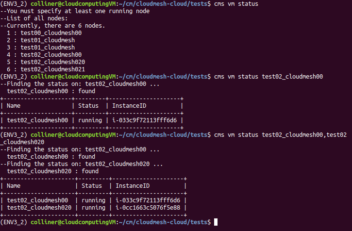
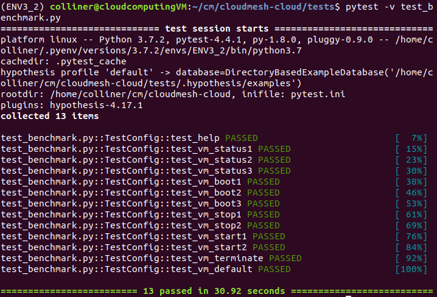
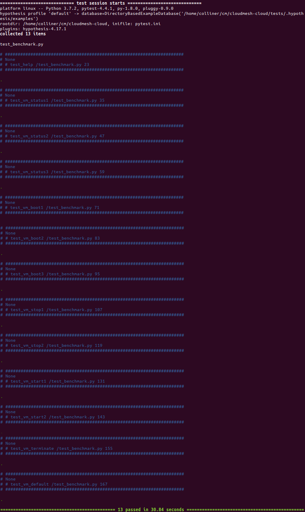

# VM Manager - AWS (ec2 / libcloud)

Eric Collins ( colliner / sp19-516-127 )

Last updated: 2 May 2019

## Introduction

An implementation of Virtual Machine manager with AWS is implemented as the
vm.py code using ec2 and libcloud. Earlier versions of the code were done with
Boto2, however, as advised, all code was converted to libcloud. Link to the code
can be found in the README. To run the AWS vm manager, AWS credentials need to
be present in ~/.cloudmesh/cloudmesh.yaml as well as the related defaults for
booting virtual machines in AWS. Below are the commands implemented into the AWS
vm manager in cloudmesh, including displaying status, booting new AWS vms,
booting multiple AWS vms, stopping vms, restarting vms, terminating vms, and
creating unique names for each new vm booted. The following is a demo (pytest
available and documents below) and explanation to how the code works. Oracle VM
VirtualBox was used running an ubuntu system, python 3.7.2 environment was used
with pyenv. More features to implement are explained at the end of this report.

NOTE: Implementation into cloudmesh-cloud was not done as per request of Gregor
on April 22nd 2019. He advised he will do the integration, so to continue in
this hid. With this, the AWS VM manager was continued here in my local hid and
not integrated into cloudmesh-cloud. For completeness sake, my code has been
benchmarked with existing benchmarks in cloudmesh-cloud as well as the pytest
found through my README file and compared at the end of this document. It is
important to note, however, that not all commands from vm and existing
benchmarks are implemented in my own version of AWS VM Manager, so some of the
tests have failed.

Lastly, at the end of the document, to aid anyone in the future of implemented
any of my work in to cloudmesh-cloud, I have left suggestions and comparisons of
my work with the existing vm code.

## Features

Features implemented by colliner include:

1. cms vm status    (displays status of aws nodes)
2. cms vm default   (displays default parameters for aws vm from .yaml file)
3. cms vm boot      (created a new node)
4. cms vm stop      (stops a currently running node)
5. cms vm start     (restarts a stopped node)
6. cms vm terminate (terminates a running or stopped node)

As well as a naming incrementer to avoid naming different nodes the same name along with --dryrun.

### cms newawsvm status

The status command is implemented to find all nodes running on AWS (or
eventually all other clouds specified). If the keyword "all" is present, status
return the status on all currently running nodes. In the example below, there
are no nodes running associated with the current AWS account. The user can
specify vm name (or names, see later in this document for multiple status
display) as shown in the next few examples of picture 1. If the name or names
are not found, status on all nodes will be displayed. If no keyword for all or
name is specified, cms vm status will default to displaying all information.


Alternatively, if there are nodes associated to the users AWS account, and "cms
vm status" is invoked with no name, a simple list of vm names will appear (see
below). If the user specifies a name and a virtual machine under that name
exists, a table will print with the corresponding information.


This can be verified through the online AWS instance manager (see below).


If many nodes are running, the user can specify multiple names in the command
line to display only certain vms status.



Verified with the online AWS instance Manager.


### cms newawsvm default

To display the default settings for creating nodes in AWS, use the command
default. This will read the ~/.cloudmesh/cloudmesh.yaml file and return the
defaults in a table.


### cms newawsvm boot

The boot command is implemented to boot a vm in AWS. If name is taken, the
increment_string() function will either:

1. add a number to the end
2. if a number is present at the end, new vm name will be incremented version of that name

As shown in the image below, to boot a vm, the user can specify no name (will
default to test01_cloudmesh for this example, can be changed or indicated by the
user). Note --dryrun returns all of the information about the node that would
have been created. Here the user can also specify any name with --name=NAME, or
--n=COUNT to start multiple vms.


WARNING: if testing the next functionary use --dryrun. The user can specify any
number of vm to start n=1000 for example and the incrementer will rename them
accordingly:


The user can also specify an image available, with image=IMAGE shown below.


The incrementer is needed because as shown in image below, AWS has no
restrictions on the name of the vm started ( as long as the InstanceID is
unique).


See below for a further explanation of the increment_string()

### cms newawsvm stop

The stop command is implemented to stop a specified vm name (see below). If no
name is specified an error occurs to enter a name. If a name of a vm that does
not exist is specified cms vm stop outputs NAME : not found; NAME was not
stopped. In the example shown below, --dryrun can be used to see if the NAME
would have been stopped. While in the absence of dryrun, the vm is stopped
(test02_cloudmesh00 stopped and test02_cloudmesh020 not stopped dryrun)


### cms newawsvm start

This command restarts a stopped node. If the node cannot be restarted or the
state is pending, stopped, or terminated, the node status will not change as
these nodes cannot be stopped.


For example, if a terminated node is asked to be restarted, the error message will occur:


### cms newaws terminate

The terminate command will terminate an vm specified through NAME or NAMES.


and can be verified through the online manager.


### increment_string()

Increment string works by finding the furthest set of numbers from the beginning
of a name and incrementing it by one. As shown in the example below, the number
of vms to start can be specified and since the name test00_cloudmesh00 was
already taken, the incrementor will find the next number. Test00 is specified in
the beginning of the string, the incrementer skips over this number and only
increments the trailing number 01 - > 05.


## pytest

A pytest with benchmarking times has been created in
https://github.com/cloudmesh-community/sp19-516-127/blob/master/project_code/cloudmesh-newawsvm/tests/test_benchmark.py
and highlighted below. The pytest goes through each command as explained above
and performed 13 total tests with different inputs, e.g. name, names, etc. All
tests are done with --dryrun and completed within 31 seconds.

NOTE: THIS WORKS WITH MY VERSION OF AWSVM MANAGER FROM
https://github.com/cloudmesh-community/sp19-516-127/blob/master/project_code/cloudmesh-newawsvm/cloudmesh/newawsvm/command/newawsvm.py
AS THE VM COMMAND IN CLOUDMESH. THIS PYTEST DOES NOT WORK WITH THE CURRENT VM
CODE IN cloudmesh-cloud/ as Gregor advised me not to copy mine over.






 PING ms : 34
 DOWNLOAD Mbps : 69.27
 UPLOAD Mbps : 5.99
```
+-------------------+-------------------------------------------------------+
| Machine Attribute | Time/s                                                |
+-------------------+-------------------------------------------------------+
| mac_version       |                                                       |
| machine           | ('x86_64',)                                           |
| node              | ('cloudcomputingVM',)                                 |
| platform          | Linux-4.18.0-17-generic-x86_64-with-debian-buster-sid |
| processor         | ('x86_64',)                                           |
| processors        | Linux                                                 |
| python            | 3.7.2 (default, Feb 14 2019, 23:11:37)                |
|                   | [GCC 7.3.0]                                           |
| release           | ('4.18.0-17-generic',)                                |
| sys               | linux                                                 |
| system            | Linux                                                 |
| user              | colliner                                              |
| version           | #18~18.04.1-Ubuntu SMP Fri Mar 15 15:27:12 UTC 2019   |
| win_version       |                                                       |
+-------------------+-------------------------------------------------------+
+------------------+------+-----------------------+--------+-------------+-------------+
| timer            | time | node                  | system | mac_version | win_version |
+------------------+------+-----------------------+--------+-------------+-------------+
| cms help         | 2.06 | ('cloudcomputingVM',) | Linux  |             |             |
| cms vm status1   | 2.96 | ('cloudcomputingVM',) | Linux  |             |             |
| cms vm status2   | 2.49 | ('cloudcomputingVM',) | Linux  |             |             |
| cms vm status3   | 2.52 | ('cloudcomputingVM',) | Linux  |             |             |
| cms vm boot1     | 2.51 | ('cloudcomputingVM',) | Linux  |             |             |
| cms vm boot2     | 2.42 | ('cloudcomputingVM',) | Linux  |             |             |
| cms vm boot3     | 2.43 | ('cloudcomputingVM',) | Linux  |             |             |
| cms vm stop1     | 2.39 | ('cloudcomputingVM',) | Linux  |             |             |
| cms vm stop2     | 3.82 | ('cloudcomputingVM',) | Linux  |             |             |
| cms vm start1    | 3.17 | ('cloudcomputingVM',) | Linux  |             |             |
| cms vm start2    | 4.0  | ('cloudcomputingVM',) | Linux  |             |             |
| cms vm terminate | 3.33 | ('cloudcomputingVM',) | Linux  |             |             |
| cms vm default   | 3.67 | ('cloudcomputingVM',) | Linux  |             |             |
+------------------+------+-----------------------+--------+-------------+-------------+
```

Benchmark results using cloudmesh-cloud/tests/test_cms_aws.py

```
+---------------------+------------------------------------------------------------------+
| Machine Arribute    | Time/s                                                           |
+---------------------+------------------------------------------------------------------+
| BUG_REPORT_URL      | "https://bugs.launchpad.net/ubuntu/"                             |
| DISTRIB_CODENAME    | bionic                                                           |
| DISTRIB_DESCRIPTION | "Ubuntu 18.04.2 LTS"                                             |
| DISTRIB_ID          | Ubuntu                                                           |
| DISTRIB_RELEASE     | 18.04                                                            |
| HOME_URL            | "https://www.ubuntu.com/"                                        |
| ID                  | ubuntu                                                           |
| ID_LIKE             | debian                                                           |
| NAME                | "Ubuntu"                                                         |
| PRETTY_NAME         | "Ubuntu 18.04.2 LTS"                                             |
| PRIVACY_POLICY_URL  | "https://www.ubuntu.com/legal/terms-and-policies/privacy-policy" |
| SUPPORT_URL         | "https://help.ubuntu.com/"                                       |
| UBUNTU_CODENAME     | bionic                                                           |
| VERSION             | "18.04.2 LTS (Bionic Beaver)"                                    |
| VERSION_CODENAME    | bionic                                                           |
| VERSION_ID          | "18.04"                                                          |
| mac_version         |                                                                  |
| machine             | ('x86_64',)                                                      |
| node                | ('cloudcomputingVM',)                                            |
| platform            | Linux-4.18.0-17-generic-x86_64-with-debian-buster-sid            |
| processor           | ('x86_64',)                                                      |
| processors          | Linux                                                            |
| python              | 3.7.2 (default, Feb 14 2019, 23:11:37)                           |
|                     | [GCC 7.3.0]                                                      |
| release             | ('4.18.0-17-generic',)                                           |
| sys                 | linux                                                            |
| system              | Linux                                                            |
| user                | colliner                                                         |
| version             | #18~18.04.1-Ubuntu SMP Fri Mar 15 15:27:12 UTC 2019              |
| win_version         |                                                                  |
+---------------------+------------------------------------------------------------------+
+-------------------------+------+-----------------------+--------+-------------+-------------+
| timer                   | time | node                  | system | mac_version | win_version |
+-------------------------+------+-----------------------+--------+-------------+-------------+
| cms vm list             | 4.05 | ('cloudcomputingVM',) | Linux  |             |             |
| cms vm status           | 2.28 | ('cloudcomputingVM',) | Linux  |             |             |
| cms vm stop dryrun      | 2.45 | ('cloudcomputingVM',) | Linux  |             |             |
| cms vm stop             | 2.32 | ('cloudcomputingVM',) | Linux  |             |             |
| cms vm ping             | 2.33 | ('cloudcomputingVM',) | Linux  |             |             |
| cms vm check            | 1.81 | ('cloudcomputingVM',) | Linux  |             |             |
| cms vm run dryrun       | 2.3  | ('cloudcomputingVM',) | Linux  |             |             |
| cms vm script dryrun    | 2.3  | ('cloudcomputingVM',) | Linux  |             |             |
| cms vm start dryrun     | 1.78 | ('cloudcomputingVM',) | Linux  |             |             |
| cms vm start            | 2.44 | ('cloudcomputingVM',) | Linux  |             |             |
| cms vm delete dryrun    | 1.83 | ('cloudcomputingVM',) | Linux  |             |             |
| cms vm terminate dryrun | 2.56 | ('cloudcomputingVM',) | Linux  |             |             |
| cms vm terminate        | 2.23 | ('cloudcomputingVM',) | Linux  |             |             |
| cms vm delete           | 1.78 | ('cloudcomputingVM',) | Linux  |             |             |
+-------------------------+------+-----------------------+--------+-------------+-------------+
```

Benchmarked timings are very similar in magnitude for the commands. Boot did not
work with the current benchmark on cloudmesh-cloud as there was an issue with
its configuration. Howver, every other command was benchmarked as work as
expected.

## Implementation into existing code: differences between my developments and current vm manager

Herein, my code for the AWS VM Manager was developed to display clear tables in
status, including listing all current vms and showing information about single
(NAME=) or multiple (NAMES=) vms with the cloudmesh implemented table printer.
The naming scheme I developed is also slightly more versatile as the current one
assumes names will all be NAME-##. My implementation looks for all numbers in a
given name,and only increments the last set. Such that cloudmesh01-test00
becomes cloudmesh01-test01 not cloudmesh02-test00 or cloudmesh02-test01. This
could be more useful later on for users who will not necessarily follow the
NAME-## scheme. VM default was also implemented, and not present in
cloudmesh-cloud/vm, so a version from my manager could be used for the actual
code.


## Other Work in the Course

1. Section/Report about High Performance Computing
2. cloudmesh-manual contributions including how to get an aws account
3. cloudmesh-manual entry about quick start guide for aws vm
3. benchmarked vm command on Ubuntu system
4. OpenAPI specification done earlier in the semester

## Concluding Remarks

Commands not included in my code (assigned to another student):

1. SSH
2. Ping
3. Wait
4. Check

SSH functionality/implementation has been started, the cms vm status would have
to display information on how to ssh into each vm however the key.pm would also
need to be located somewhere nearby or indicated in the cloudmesh.yaml file.
The way this vm manager is setup lends well to expanstion to multiple types of
clouds, as the data structure for cloud/nodes is an array which my
implementation loops over. This could be useful for finding names of nodes from
multiple cloud providers and if booted with my code would check all nodes for a
similar name before booting up the new node. MongoDB could also be used to store
the status/update it when changed for any of the nodes, then this code could
update the status from the clouds and read from MongoDB.

